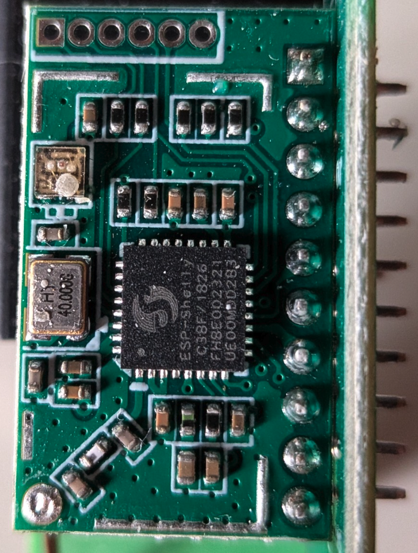
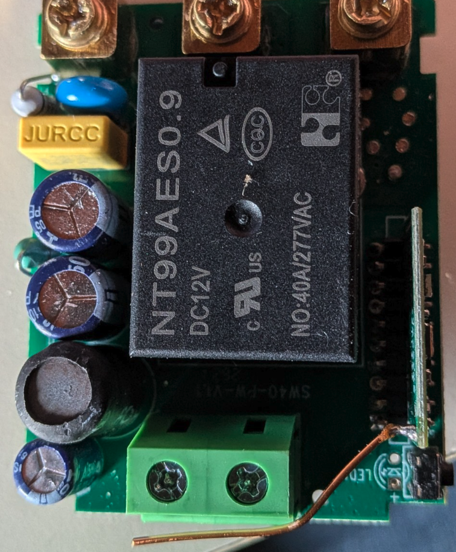
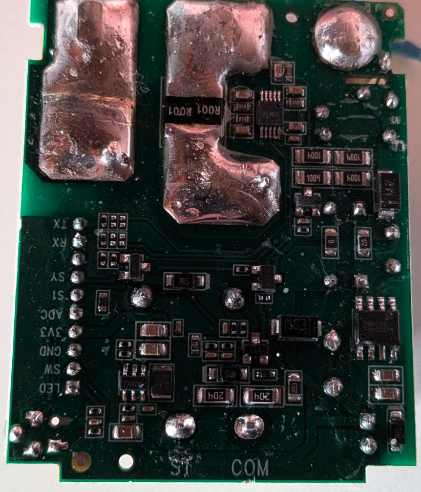

I spent some time taking apart an **Ogemray SW40 PbS** also known as **Ogemray 25A**, the 25A relay with power metering sold under Shelly's "Powered by Shelly" (PbS) label, and reading through its firmware. I couldn't find anything written up about it, so I'm sharing what I found in case someone wants to work on support for it. I'm not going to do the port myself, and I only have one unit, which is now back in service, so I can check small things but can't do much experimenting.

All the pin assignments below come from analyzing the stock firmware and from probing, and they're identical in firmware 2.0.0 and 2.0.1.

## Hardware

| | |
|---|---|
| Model string | `S3PB-O3AR000001`, Shelly app name `Ogemray25`, Gen3 |
| Module | Daughterboard with an **ESP-Shelly-C38F** (ESP32-C3, rev v0.4, 8 MB embedded flash), 40 MHz crystal, wire antenna. The firmware identifies the platform as Shelly X MOD1 |
| Metering IC | **Silergy SY7T502**, MSOP-10, two 1 mΩ shunts in parallel |
| Relay | NT99AES0.9, 12 V DC coil, NO contact rated 40 A / 277 VAC; the device itself is rated 25 A / 6000 W |
| Inputs | one switch input (S1 / COM terminals), one push button |
| LED | one addressable RGB, on the module board |
| Bootloader | Shelly OS loader 1.0.3, ESP-IDF 5.5.2-s6 |

## Pinout

The main board and the module board are joined by a 10-pad header, labelled on the main board:

| Pad | Function | GPIO |
|---|---|---|
| `TX` | to SY7T502 | 10 |
| `RX` | from SY7T502 | 5 |
| (no label) | unknown, no firmware use found | — |
| `SY` | SY7T502 supply / enable | 7 |
| `S1` | switch input (after the isolating front end, not the raw terminal) | 6 |
| `SW` | push button, active low | 4 |
| `ADC` | NTC, ADC1 channel 1 | 1 |
| `LED` | not populated on my unit | — |
| `3V3`, `GND` | | |

The module board has a separate 6-pin service header with no silkscreen:

| Pin | Signal | GPIO |
|---|---|---|
| 1 (the squared one) | TXD0 | 21 |
| 2 | RXD0 | 20 |
| 3 | 3V3 | |
| 4 | EN | |
| 5 | BOOT | 9 |
| 6 | GND | |

Heads-up: both headers have a `TX`/`RX`. The ones on the main board are the metering bus, so a terminal there just shows garbage. The console is on the service header (the unlabeled one), at 115200 8N1.

Not on either header: the status LED on **GPIO18**. GPIO 0, 2, 3 and 8 are unused.

The ESP-Shelly-C38F is the same chip used on the Shelly 1PM Gen3, so existing ESP32-C3 8 MB board settings should apply.

NTC parameters from the firmware: B = 3450, 10 kΩ at 25 °C, over-temperature thresholds at 95 °C and 105 °C.

## The metering IC

This isn't a BL0942 board like most Shelly Gen3 devices. It's a Silergy SY7T502, and the stock firmware talks to it on UART1 at **4800 baud**. GPIO7 has to be driven before the chip answers at all. At debug level 3 the driver prints its own config at boot:

```
D y_sy7t502_driver.cpp:27 SY7T502 power_pin=7 uart=1 rx=5 tx=10 baud=4800
I _sy7t502_driver.cpp:101 Init SY7T502 PM Done!
```

The bigger catch is the relay: **it has no GPIO**. There's no relay pad on the header, and the stock firmware creates its switch output through the SY7T502 driver, bound to the IC with no pin. The SY7T502 has built-in relay control with zero-crossing timing and contact feedback, and as far as I can tell that's what gets used. So a port needs a driver that writes the IC's relay registers, not a `gpio` switch.

I don't know of any existing SY7T502 driver. The closest starting point I found is the community ESPHome component for the SY7T609 ([fishsugar/esphome_sy7t609](https://github.com/fishsugar/esphome_sy7t609)), which uses the same Silergy framing over UART but a different register map. The SY7T501/SY7T502 datasheet is downloadable from Silergy's site and documents the protocol, the measurement and calibration registers, and the relay block.

I didn't find where the stock firmware keeps metering calibration, if it keeps any. It isn't in NVS (only Wi-Fi RF calibration there) or in the factory partition (just model, batch and cloud key).

One thing I noticed in the stock logs: the SY7T502 driver throws an occasional `Uart Timeout!` and `UpdateAll entered in a wrong state`, so the link isn't perfectly clean even with Shelly's own code.

## Status LED

A single WS2812-style RGB on GPIO18, driven over RMT (20 MHz resolution, 64 memory symbols, one LED). It shows red during reset or emergency mode, green in normal use and blinks red and blue during a firmware update.

## Button and factory reset

From the stock firmware, in case a port wants to keep the same behaviour:

- The action is chosen **on release**, by how long the button was held: about 5 s resets Wi-Fi and BLE settings, 8 s or 10 s does a factory reset, 30 s does a factory reset and also clears the default config.
- Holding the button while the device boots, and letting go within 10 s, starts **safe mode** (scripts, schedules, webhooks and eco mode off for that boot). Ten quick restarts in a row trigger safe mode on their own.
- The switch input can factory-reset the device too: **5 toggles within the first 60 s after power-up**, with no more than 10 s between them.

None of these clear the debug settings, which is why a broken debug config can't be undone from the button.

## Flashing

- No secure boot and no flash encryption. Reading and writing over serial with esptool works fine. I read the full 8 MB at 115200; 460800 stalled halfway with my adapter.
- OTA conversion isn't an option: the update zip carries an ECDSA signature that the firmware checks, so the mgos32-to-tasmota32 approach doesn't apply here.
- Download mode: hold BOOT (pin 5) low, pulse EN (pin 4) low, release EN, then release BOOT.
- **Disconnect mains** and power the board from 3.3 V. The logic ground is referenced to mains. The ESP32-C3 peaks around 350 mA, so a weak 3.3 V from a cheap USB-UART adapter isn't enough.
- **Back up the `shelly` partition at `0x7f0000`** before writing anything. It holds the device identity, and there's no other copy of it anywhere.
- The console of the *running* firmware is only partly readable, roughly half the bytes come out garbled, most likely because eco mode shifts the clock. Download mode isn't affected.
- OTA updates go to the inactive slot: the device reported slot 0 on 2.0.0 and slot 1 after updating to 2.0.1. Bootloader and partition table are identical in both releases.

Partition table:

```
otadata  0x011000   8K
nvs      0x014000  48K
app_0    0x020000  2560K
fs_0     0x2a0000  1024K   LittleFS
app_1    0x3a0000  2560K
fs_1     0x620000  1024K
scratch  0x7e0000  64K
shelly   0x7f0000  64K     factory data, keep it
```

## Serial output (redacted)

Second-stage bootloader:

```
boot: chip revision: v0.4
boot: efuse block revision: v1.3
boot.esp32c3: SPI Speed      : 80MHz
boot.esp32c3: SPI Mode       : DIO
boot.esp32c3: SPI Flash Size : 8MB
shos_ota: Booting app 0
esp_image: segment 0: paddr=00020020 vaddr=3c1e0020 size=3ddf0h (253424) map
esp_image: segment 1: paddr=0005de18 vaddr=3fc92a00 size=02200h (  8704) load
esp_image: segment 2: paddr=00060020 vaddr=42000020 size=1d59ach (1923500) map
```

A full, anonymised capture of a reboot at debug level 3 (ROM, bootloader and application start-up) is in [logs/serial-boot-debug-level3.log](logs/serial-boot-debug-level3.log).

Stock firmware at runtime, debug level 3:

```
D y_sy7t502_driver.cpp:27 SY7T502 power_pin=7 uart=1 rx=5 tx=10 baud=4800
I _sy7t502_driver.cpp:101 Init SY7T502 PM Done!
D helly_sy7t502_pm.cpp:95 Voltage: 237.255508, Current: 0.000000, Active Power: 0.000000, Frequency: 50.000000, Energy: 0.000000
D erature_monitor.cpp:103 Temp 0: uptime 1120.60, tC 29.51, ot 0, hf 150696
E _sy7t502_driver.cpp:353 ERROR: Uart Timeout!, retries: 1
```

A warning if you poke at it with the stock firmware: don't turn on the file logger (`sys.debug.file_log`) at debug level 3. Every file write gets logged, the logger writes that to a file, and it never stops. The unit dropped off Wi-Fi, the button stopped responding past its first level, and I had to fix the config over serial, using esptool to dump the config partition, edit it and flash it back.

# Pictures

### Daughterboard

The service header is at the top left, pins 1 (square pad) to 6.



### Main board, top



### Main board, bottom


